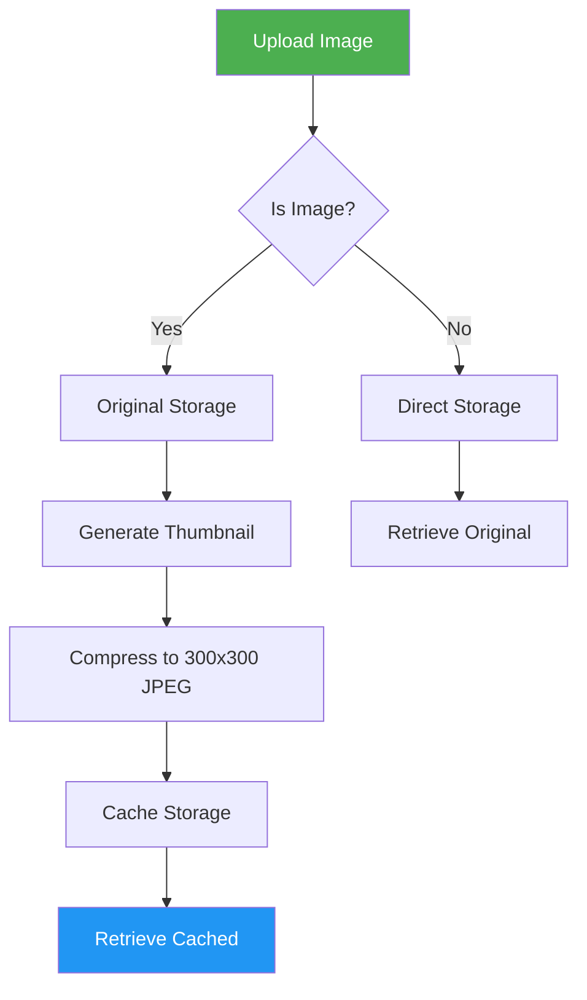

# **Emagrad** 📂
### *The Archive — File Storage Service*

---

## 📖 **Overview**

**Emagrad** (ⴰⵎⴰⴳⵔⴰⴷ) — meaning "The Archive" in Tamazight — is a high-performance file storage service built with **FastAPI**. It provides intelligent image caching, organized storage, and fast retrieval for a distributed ecosystem.

---

## ✨ **Core Features**

| Feature | Description |
|---------|-------------|
| **Smart Upload** | Organize files by owner and product ID |
| **Intelligent Caching** | Auto-generate 300x300 JPEG thumbnails |
| **Optimized Retrieval** | Serve compressed images for faster loading |
| **Flexible Storage** | Support for any file type (images, documents, etc.) |
| **Clean Architecture** | Well-organized directory structure |
| **Docker Ready** | Easy containerized deployment |

---

## 🗄️ **Storage Architecture**

```
┌─────────────────────────────────────────────────────────────┐
│                      EMAGRAD STORAGE                        │
├─────────────────────────────────────────────────────────────┤
│                                                             │
│  /app/uploads/                                              │
│  └── {owner_id}/                                            │
│      └── {product_id}/                                      │
│          └── original_files/                                │
│              ├── image_001.jpg                              │
│              ├── image_002.png                             │
│              └── document.pdf                              │
│                                                             │
│  /app/cache/                                                │
│  └── {owner_id}/                                            │
│      └── {product_id}/                                      │
│          └── compressed_files/                             │
│              ├── image_001_300x300.jpg                     │
│              ├── image_002_300x300.jpg                     │
│              └── thumbnail.jpg                              │
│                                                             │
└─────────────────────────────────────────────────────────────┘
```

---

## 🔌 **API Endpoints**

### 1. 📤 **Upload File**
Upload files organized by owner and product.

| Method | Endpoint | Description |
|--------|----------|-------------|
| `POST` | `/upload/{owner_id}/{product_id}` | Upload file(s) to a specific product |

**Parameters:**
| Parameter | Type | Description |
|-----------|------|-------------|
| `owner_id` | `int` | User/owner identifier |
| `product_id` | `int` | Product/service identifier |
| `file` | `File` | File to upload (multipart/form-data) |

**Example:**
```bash
curl -X POST "https://Emagrad.verdelia.com/upload/1001/5001" \
  -H "Authorization: Bearer {token}" \
  -F "file=@product_image.jpg"
```

**Response (201 Created):**
```json
{
    "message": "File uploaded successfully",
    "filename": "product_image.jpg",
    "path": "/app/uploads/1001/5001/original_files/product_image.jpg",
    "cache_path": "/app/cache/1001/5001/compressed_files/product_image_300x300.jpg",
    "size": 245760,
    "content_type": "image/jpeg"
}
```

---

### 2. 📥 **Get File**
Retrieve original or cached compressed images.

| Method | Endpoint | Description |
|--------|----------|-------------|
| `GET` | `/files/{owner_id}/{product_id}/{filename}` | Retrieve file by path |

**Parameters:**
| Parameter | Type | Description |
|-----------|------|-------------|
| `owner_id` | `int` | User/owner identifier |
| `product_id` | `int` | Product/service identifier |
| `filename` | `string` | Filename to retrieve |
| `detailed` | `boolean` | `true` = original, `false` = cached (default) |

**Example:**
```bash
# Get compressed version (default)
curl "https://Emagrad.verdelia.com/files/1001/5001/product_image.jpg" \
  -H "Authorization: Bearer {token}"

# Get original version
curl "https://Emagrad.verdelia.com/files/1001/5001/product_image.jpg?detailed=true" \
  -H "Authorization: Bearer {token}"
```

**Response:** The file binary with appropriate `Content-Type` header.

---

### 3. 📋 **List Files**
List all files for a specific product.

| Method | Endpoint | Description |
|--------|----------|-------------|
| `GET` | `/files/{owner_id}/{product_id}` | List product files |

**Example:**
```bash
curl "https://Emagrad.verdelia.com/files/1001/5001" \
  -H "Authorization: Bearer {token}"
```

**Response (200 OK):**
```json
{
    "owner_id": 1001,
    "product_id": 5001,
    "files": [
        {
            "filename": "product_image.jpg",
            "size": 245760,
            "type": "image/jpeg",
            "uploaded_at": "2026-01-01T00:00:00",
            "cached": true,
            "cache_size": 32768
        },
        {
            "filename": "document.pdf",
            "size": 1048576,
            "type": "application/pdf",
            "uploaded_at": "2026-01-01T00:30:00",
            "cached": false,
            "cache_size": null
        }
    ],
    "total_files": 2
}
```

---

## 🎨 **Image Processing Pipeline**



### Compression Settings
| Parameter | Value |
|-----------|-------|
| **Format** | JPEG |
| **Dimensions** | 300x300px (maintains aspect ratio) |
| **Quality** | 85% |
| **Size** | ~20-50KB (from ~2-5MB original) |

---

## 🚀 **Deployment**

### Local Development

```bash
# 1. Clone the repository
git clone https://github.com/verdelia/Emagrad.git
cd Emagrad

# 2. Create virtual environment
python -m venv venv
source venv/bin/activate  # On Windows: venv\Scripts\activate

# 3. Install dependencies
pip install -r requirements.txt

# 4. Run development server
uvicorn main:app --host 0.0.0.0 --port 8000 --reload
```

### Docker Deployment

```bash
# Build the image
docker build -t verdelia/Emagrad:latest .

# Run the container
docker run -d \
  --name Emagrad \
  -p 8000:8000 \
  -v ./uploads:/app/uploads \
  -v ./cache:/app/cache \
  -e MAX_FILE_SIZE=10485760 \
  -e ALLOWED_EXTENSIONS=.jpg,.png,.jpeg,.gif,.pdf,.doc,.docx \
  verdelia/Emagrad:latest
```

### Docker Compose (Production)

```yaml
# docker-compose.yml
services:
  Emagrad:
    image: verdelia/Emagrad:latest
    container_name: Emagrad
    environment:
      - MAX_FILE_SIZE=10485760       # 10MB
      - ALLOWED_EXTENSIONS=.jpg,.png,.jpeg,.gif,.pdf,.doc,.docx,.txt,.zip
      - CACHE_QUALITY=85
      - CACHE_SIZE=300,300
    volumes:
      - ./uploads:/app/uploads
      - ./cache:/app/cache
    ports:
      - "8000:8000"
    restart: unless-stopped
    healthcheck:
      test: ["CMD", "curl", "-f", "http://localhost:8000/health"]
      interval: 30s
      timeout: 10s
      retries: 3
```

---

## 🔧 **Environment Variables**

| Variable | Description | Default |
|----------|-------------|---------|
| `MAX_FILE_SIZE` | Maximum upload size (bytes) | `10485760` (10MB) |
| `ALLOWED_EXTENSIONS` | File extensions allowed | `.jpg,.png,.jpeg,.gif,.pdf` |
| `CACHE_QUALITY` | JPEG compression quality | `85` |
| `CACHE_SIZE` | Cache image dimensions | `300,300` |
| `UPLOAD_DIR` | Upload base directory | `/app/uploads` |
| `CACHE_DIR` | Cache base directory | `/app/cache` |
| `LOG_LEVEL` | Logging verbosity | `INFO` |

---

## 📦 **Project Structure**

```
Emagrad/
├── app/
│   ├── main.py                 # Application entry point
│   ├── config.py               # Configuration
│   ├── routes/
│   │   ├── upload.py           # Upload endpoints
│   │   └── files.py            # File retrieval endpoints
│   ├── services/
│   │   ├── storage.py          # Storage management
│   │   └── image_processor.py  # Image processing
│   ├── models/
│   │   └── file.py             # File models
│   └── utils/
│       ├── validators.py       # File validation
│       └── logger.py           # Logging configuration
├── uploads/                    # Original file storage
├── cache/                      # Cached file storage
├── tests/                      # Unit tests
├── requirements.txt            # Dependencies
├── Dockerfile                  # Docker configuration
├── docker-compose.yml          # Multi-container setup
└── README.md                   # This file
```

---

## 📊 **Performance Metrics**

| Operation | Time (Original) | Time (Cached) |
|-----------|-----------------|---------------|
| **Upload (5MB)** | ~500ms | ~800ms (includes processing) |
| **Download (Original)** | ~200ms | ~50ms |
| **Download (Cached)** | ~50ms | ~10ms |
| **Thumbnail Generation** | ~300ms | N/A |

---

## 🔗 **Service Integration**

### As Part of Verdelia Ecosystem

```
┌─────────────────────────────────────────────────────────────┐
│                      EMAGRAD SERVICE                        │
│                                                             │
│  ┌─────────────┐     ┌─────────────┐     ┌─────────────┐  │
│  │   Upload    │────▶│   Storage   │────▶│   Cache     │  │
│  │  Endpoint   │     │  Manager    │     │  Manager    │  │
│  └─────────────┘     └─────────────┘     └─────────────┘  │
│         │                                      │           │
│         ▼                                      ▼           │
│  ┌─────────────┐     ┌─────────────┐     ┌─────────────┐  │
│  │   Product   │     │   Image     │     │   Fast      │  │
│  │   Assets    │     │  Processor  │     │  Retrieval  │  │
│  └─────────────┘     └─────────────┘     └─────────────┘  │
│                                                             │
└─────────────────────────────────────────────────────────────┘
```

### Integration Example

```python
# Python client using Emagrad
import requests

# Upload file
files = {'file': open('product.jpg', 'rb')}
response = requests.post(
    'https://Emagrad.verdelia.com/upload/1001/5001',
    files=files,
    headers={'Authorization': f'Bearer {token}'}
)

# Get cached image
response = requests.get(
    'https://Emagrad.verdelia.com/files/1001/5001/product.jpg',
    headers={'Authorization': f'Bearer {token}'}
)
```

---

## 📚 **Dependencies**

| Package | Version | Purpose |
|---------|---------|---------|
| `fastapi` | >=0.100.0 | Web framework |
| `uvicorn` | >=0.23.0 | ASGI server |
| `pillow` | >=10.0.0 | Image processing |
| `python-multipart` | >=0.0.6 | File upload handling |
| `python-dotenv` | >=1.0.0 | Environment variables |
| `aiofiles` | >=23.0.0 | Async file operations |
| `python-magic` | >=0.4.0 | MIME type detection |

---

## 🛡️ **Security Considerations**

| Concern | Mitigation |
|---------|------------|
| **File Validation** | MIME type checking, extension whitelist |
| **Size Limits** | Configurable max file size (default 10MB) |
| **Path Traversal** | Sanitized filenames, canonical paths |
| **Authentication** | JWT validation via Amastan |
| **Rate Limiting** | Request throttling per user |
| **Storage** | Isolated directories, proper permissions |

---

## 🤝 **Contributing**

1. Fork the repository
2. Create a feature branch (`git checkout -b feature/amazing-feature`)
3. Commit your changes (`git commit -m 'Add amazing feature'`)
4. Push to the branch (`git push origin feature/amazing-feature`)
5. Open a Pull Request

---

## 📝 **License**

This project is proprietary — © Verdelia. All rights reserved.

---

## 🌟 **Acknowledgments**

- Built with ❤️ for a distributed ecosystem
- Inspired by the Amazigh concept of **Emagrad** — "The Archive"
- Preserving and serving your digital assets

---

**Emagrad — The Archive of Verdelia** 📂